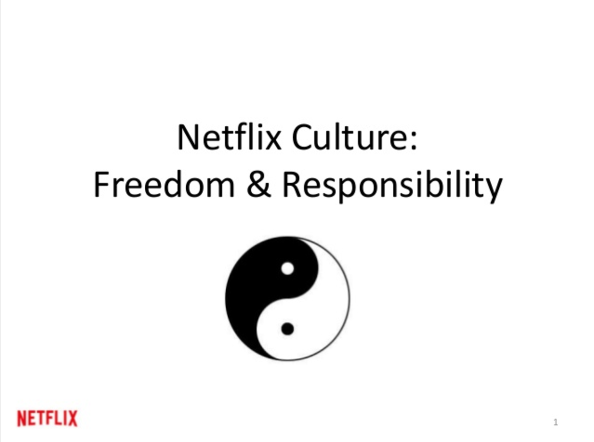

# As I walk through the Silicon Valley

The posse maps out the sphere of influence of Silicon Valley. 
 
OPT:  
Computer chips used to be developed and manufactured in the South bay of San Francisco, California. They are made from silicon, hence the name. The production of chips has since long moved away from Silicon Valley but what stayed were the high-tech companies. Silicon Valley is now a booming ecosystem of startup companies. And, GAFAM are all based in Silicon Valley.

GON:  
GAFAM?

OPT:  
GAFAM is a term coined by Bruce Sterling, a design critic and writer of cyberpunk novels. In the design discourse, since the beginning of the internet, people have been looking for words and ways to describe the internet. He argued in 02014[^stewart] that it doesn't make sense to still talk about _the internet_[^sterling] but that we should instead talk about Google, Amazon, Facebook, Apple and Microsoft (GAFAM): Silicon Valley's giant technology corporations. 

REN:  
That makes perfect sense. Software originating from the Silicon Valley is distributed across the globe and influences how we work, play and think. And more than that. It's a place of technological innovation which is connected to almost all aspects of life. Business, healthcare, travel, leisure, marketing. 

OPT:  
The reach of Silicon Valley is world wide. The geographic place doesn't matter much. More so do the ideals that come from it. This because a lot of people are looking at the Silicon Valley culture as an example for their businesses. 

The American Dream, a climate with lots of competition, little government support, I'm not really sure what to attribute the American individualism to, but I think it's very obvious in the culture of Silicon Valley. There seems to be a large focus on personal development. That anyone can be anything.

There is a big startup culture. A startup is actually nothing more than a beginning company, but as a term has come to stand for a small and fast-growing business. Lots of startups in the technology sector compete for a place in the market. And because technology is big business, there is a lot of money to be won. The pace of business is high. 

These startups are often funded with money from Venture Capitalists or Angel Investors. In short, Venture Capitalists are bigger institutions that invest money in technology companies. Angel Investors are individuals, usually with some senior experience in the field, who back the company with their money and can act as a kind of business mentor.

I see Silicon Valley as the Hollywood of technology. It's fast, there is a high concentration of superstars of their field, it is a place where there is constant innovation and competition, and so on. It's also comfortably situated on the West Coast of the United States. Its export product is technology where Hollywood exports movies. And while movies were already of a huge influence on our culture, the technology wave is undoubtedly even more succesful. 

## BEER IS CHEAP

In Silicon Valley there is a strong belief that startups can disrupt the market. Disruption is a marketing term where your product changes the market completely instead of just competing with the existing products or services on that market.

When Dan Lyons[^lyons] got laid off from his job as a journalist he made the switch to one of the unicorn startups he'd been writing about. A unicorn startup is a startup valued over 1 billion US dollars. The name unicorn comes from the rare nature of this occurance.[^unicorn]  Being in his fifties, he was a bit of an outsider in this young company and his short-lived experience resulted in the book _Disrupted: My Misadventure In The Start-up Bubble_. The bubble in the title describes two things: first the valuation bubble and second the filter bubble that surrounds the startup world. 

The valuation bubble: In the last ten years, the amount of tech unicorns has raised enormously. The company Lyons was working for was losing money, while being valued as a unicorn. And at the same time, employees were getting free beer and a fun working environment. Lyons asks a colleague how it's possible the company loses money, and yet is handing out free beers.

You're running a company that is never going to make money. You need a lot of cheap labor. You hire people right out of school and feed them a story about a big mission and put them in quite low level jobs. And you give them beer. 

You burn 'em out and churn 'em out. You recruit young people for their fresh skills. But they are lead on and never get any real benefits. For the company, beer is cheap but ownership in the company is valuable. The beer is for the employees, the ownership for them. This is the Venture Capitalists wet dream, but it's not so good for the employees.

![Video still from Silvio Lorusso's <em>Fake It Till You Make It</em>[^fake-it] that shows footage of two start-up founders that both were driven entrepreneurs in Silicon Valley and both committed suicide while leading their tech startup.](../img/Fake-it.png)

He has his concerns about how Silicon Valley hires and treats people. That's made possible by the filter bubble: In 02009 Netflix's culture code was lauded by Cheryl Sandberg of Facebook as “may be the most important document ever to come out of the Valley.”[^netflix-cult] It put emphasis on the company as “a team, not a family.” Every position in the company needs a star player. So if you're not performing, you're out. The old idea of job security doesn't apply. 

REN:  
Am I the only one here that thinks this is worrying? 

OPT:  
Not here. Globally, maybe, because companies all over the world are looking at Silicon Valley as a market leader, as an example to look up to and learn from.

REN:  
I think you would appreciate the work of this guy. Silvio Lorusso is an Italian designer who observes the new defaults of entrepreneurialism.[^work-ethic] He maintains a blog where he playfully yet seriously describes new working conditions. The group of workers he describes is not limited to Silicon Valley. It's world wide and he calls this the entreprecariat. The entreprecariat is not one thing. Rather, it's a force field around the conditions of entrepreneurialism and the precariat. He studies the conditions of people in this condition and made this statement to describe what he thinks we should / could do about it.

>We need to take advantage of wit, irony and sarcasm to recombine our collective understanding of precarious conditions. This is what the entreprecariat should be about.

## IN THE HANDS OF DEFAULT SETTERS

OPT:  
GAFAM and startup Silicon Valley hold the default settings to a large part of the internet.

REN:  
It wasn't always like that. I think in the beginning of the internet, people were customizing everything more. They wanted to touch every page with their own style. The whole idea of stylesheets[^stylesheets] was to have a _personal_ stylesheet which you could use on every page on the internet. Instead, pages would start to offer their own stylesheets. And after that stylistic power has been moved from the individual user to the provider, new standards came to be which we are now happily accepting, _because they work_.

OPT:  
Of course defaults go way beyond just the looks of a website. In fact, that's only the first place you see it happening. One of the places where defaultism turns out harmful instead of helpful is in the User Agreement.[^hoback] That legal document that pops up when you install software or make online purchases. It's full of important information about what data providers are gathering and what they are allowed to do with it. 

Nobody reads it because the texts are long, full of formalities, et cetera. Silicon Valley has found out one thing soon enough: when you want to do something evil, wrap it into something boring. And so with the promise of free service, you accept. But to what? You don't know. That kind of default can be really harmful. An extraordinary example of this practice was Gamestation.co.uk's 02010 April Fool's prank.[^soul] They added some text to their User Agreement that transfers the user's soul to the company. 

In this case, 7500 people transferred their souls, free of charge. Of course, this is a funny prank, but it also shows we have no idea what we're signing for. This is a scary idea as a user.

In the organ donation business, an opt-out pattern means that you are by default a donor and you have to actively register if you don't want to be a donor. In practice, an opt-out pattern means that a lot more people will donate their organs.[^organs] Summing up, it's important to see what kind of standards and defaults are being introduced to us, may that be ex- or implicitly. And even if it's an explicit default, like the user agreement, there might be something we've failed to read. It's key to read and look critically at what's offered. It's also 🔑 to keep sniffing around and seeing what's really happening in the hands of default setters. 

GON:  
Silicon Valley as the capital of the Land of the Semi-Free and the Home of the Business-Savy! 

[^stylesheets]: Code to determine the look of websites.

[^soul]: _7,500 Online Shoppers Accidentally Sold Their Souls To Gamestation_ [http://www.huffingtonpost.com/2010/04/17/gamestation-grabs-souls-o_n_541549.html](http://www.huffingtonpost.com/2010/04/17/gamestation-grabs-souls-o_n_541549.html)

[^sterling]: Alexis C. Madrigal, _Bruce Sterling on Why It Stopped Making Sense to Talk About 'The Internet' in 2012_, [http://www.theatlantic.com/technology/archive/2012/12/- ](http://www.theatlantic.com/technology/archive/2012/12/-bruce-sterling-on-why-it-stopped-making-sense-to-talk-about-the-internet-in-2012/266674/ )

[^fake-it]: Silvio Lorusso, _Fake It Till You Make It_, 02016 [https://vimeo.com/151528608](https://vimeo.com/151528608)

[^netflix-cult]: Nancy Hass, _And the Award for the Next HBO Goes to..._, [http://www.gq.com/story/netflix-founder-reed-hastings-house-of-cards-arrested-development?mobify=0](http://www.gq.com/story/netflix-founder-reed-hastings-house-of-cards-arrested-development?mobify=0)

[^work-ethic]: Silvio Lorusso, _What is the Entreprecariat?_, [http://networkcultures.org/entreprecariat/what-is-the-entreprecariat/](http://networkcultures.org/entreprecariat/what-is-the-entreprecariat/)

[^lyons]: Dan Lyons, _Inside the Tech Start-up Bubble | Dan Lyons | RSA Replay_ [https://youtu.be/oO836hHCmZA](https://youtu.be/oO836hHCmZA)

[^unicorn]: CBInsights, _The Increasingly Crowded Unicorn Club_ (infographic)[http://www.visualcapitalist.com/the-increasingly-crowded-unicorn-club/](http://www.visualcapitalist.com/the-increasingly-crowded-unicorn-club/)

[^hoback]: Cullen Hoback, _Terms and Conditions May Apply_, [https://vimeo.com/98094467](https://vimeo.com/98094467)

[^carr]: Nicholas Carr, _The Shallows, What The Internet Is Doing To Our Brains_

[^netflix-culture]: Reed Hastings (CEO at Netflix), _Culture_, [http://www.slideshare.net/reed2001/culture-1798664/](http://www.slideshare.net/reed2001/culture-1798664/)

[^stewart]: As a founder of the Viridian Design Movement, Sterling used the extra 0 to put emphasis on optimism towards the faraway future.

[^organs]: Harry Brignul, _Dark Patterns: User Interfaces Used To Trick People_ [https://youtu.be/1KVyFio8gw4](https://youtu.be/1KVyFio8gw4)

<footer></footer>