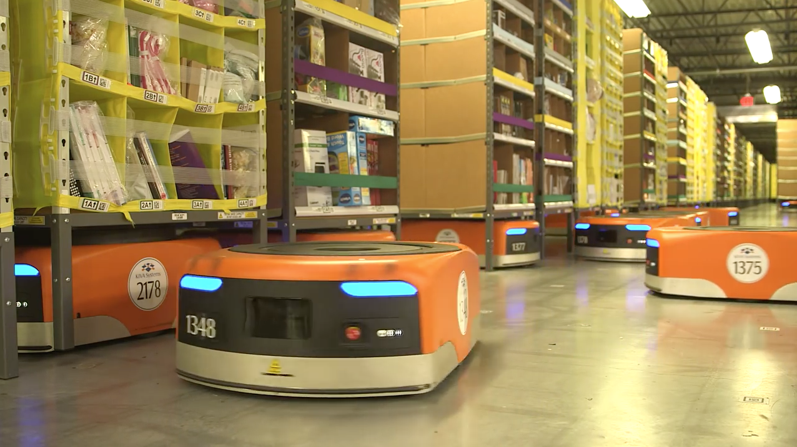

# BIG, COMPLEX WEB

The Renegade and Gonzo are amazed by the complexity of the internet. They discuss ways companies handle work behind the screens and wonder if we can learn from that. With Optimo, they talk about the way users and designers can deal with this complexity.

## THE SHAPE OF THE CLOUD

GON:  
The scale of the internet is something mind-boggling. Everytime I use the internet, I'm surprised it works.

REN:  
I agree. The back end is the place where it all happens. What happens there is the really amazing part of the internet. The back end are the hidden processes, the calculations and programs running for front end services.

OPT:  
Tech companies develop products with scalability in mind. Scalability is the ability of a system to become more efficient or optimal when its application grows. Take for example a search engine. The more content it searches, the more interesting the search engine is for its users. Google for ten things is not as useful as Google for a million things, and this becomes more true the bigger we go. How scaling works technically can be extremely complex, so as a user we almost never see processes behind our actions. We see the front end of a process in the shape of an interface, the work happens in The Cloud. 

GON:  
It's so weird they call the back end ‘The Cloud’. That's misleading users: The Cloud is physical. It is server farms, interconnected via cables. I say wireless is only a half-truth when there are strings attached. 

## ROBOTS SERVING HUMANS

OPT:  
I love watching this video[^kiva] of the sorting robots in Amazon's warehouses. How they find their own way through the warehouse is marvelous to see.

<figure id="kiva">

<figcaption>The Kiva robots are a good example of how software has shaped the physical world. These robots are an essential part of the Amazon delivery chain and boost delivery speed.</figcaption>
</figure>

<iframe width="1280" height="720" src="https://www.youtube.com/embed/quWFjS3Ci7A?rel=0" frameborder="0" allowfullscreen></iframe>

The warehouses no longer store items sorted for humans. Instead, the objects are placed on the shelves according to what is fastest. The system knows what shelves carries which item, the robots carry those shelves to ‘pick-workers’ that take the items out of the shelves and pack them for sending. The robot finds its own way through the warehouse. They can do this without bumping into other robots or human beings. 

This way they can process an order from click to send sometimes in less than 15 minutes. Amazon has 21 million different items for sale. The warehouse needs less walking space, because humans don't need to walk through aisles anymore. This operation is scalable as hell.

You'll see the worker doesn't have to do much of anything anymore. The entire system is developed to make human work as simple as possible.

> “Pick, scan, pack. We try to simplify their life and hide the technology. All Kiva Pick workers are happy pick workers.”
> Mick Mountz, CEO of Kiva Systems [^pick]

REN:  
Wow, I wouldn't want to be one of those. Let me play with the code of those bots, though.

GON:  
Amazing about this is the system itself. It's impressive how they got all of this to run so smoothly. Even though the pick workers have a bit of a boring job, the comparison is easily made with picking stuff from trees, how nice of a job was that? And this means less hard work. Less bending over, reaching, easy money, no? 

## CENTRALIZATION ISSUES

REN:  
So, let's talk big safety problems now. In June 2013, Edward Snowden, who worked for the NSA-affiliated defense contractor Booz Allen Hamilton leaked a great amount of files of the USA's National Security Agency's massive surveillance practices. The NSA can spy and did spy on innocent citizens as well as criminals[^nsa] all around the world using back doors to big service providers on the internet.

This is a dark side of a big centralized internet. One part of that darkness is the strong influence of the United States' secret service. Another thing is the access to Silicon Valley's major servers, where personal data is stored. Microsoft, Facebook, Google, Skype, you name it. Governments like this centralized power because it's easy access for them. 

The structure of the internet hasn't changed much since the beginning. Files are stored on a central server, for instance one from Google. When using Google, all traffic runs through that server and all information is in one place.

 

REN:  
It's a pretty serious problem. As designers, we should be aware of these kind of issues in the media. And I think we should start at the very root of the problem. One of the problems is the centralized network. 

An alternative could be a distributed network. A centralized network has a big, central server infrastructure where all the data and files are stored. A decentralized system doesn't have that. There, files are stored on parts of the network. 

I've been following the developments of Bitcoin - a cryptocurrency - and with that, the Blockchain. The Blockchain is a technology that offers a new kind of server infrastructure. There are different possibilities, but one example could be: All nodes in the network store a full copy of all transactions on that network while all relevant files and data can stay on individual drives.[^blockchains] 

In a direct way, this does not solve any problems. But it allows for new beginnings, and a new type of internet which is more equal and distributed, instead of controlled centrally by one or a handful of parties.

## The Chaos Monkey

REN:  
The Chaos Monkey periodically takes subsystems out of commision and sees how it responds. The idea is to lower the gap between how Netflix expects the system to work and how the system actually works. In biology this is how you learn about a living thing. Actively trying to mutate it is a biological technique.

A lot of programming is now what we call procedural. Basically what that means is for the programmer to predict enough states so the computer can do the calculation. If this happens, do that.

With deep learning comes another, probabalistic reasoning system. If I see this input, I _think_ I should do that. 

GON:  
Why does it even matter to know these things? I know that the technical stuff is very complicated, but I don't care. I just want them to work.

REN:  
Sure. It's one thing to say: There is an expert somewhere that knows what's going on and we let them do the understanding. But more and more there is no such expert.

When systems get big enough they almost seem biological. A good example is when a big service is being built there is this thing called The _Change Review Board_. It can be 12 people there, who all have their specialty. One for network, one for storage, one for application development, et cetera. When they make changes to their parts, they have to say them out loud to the other 11 to see if that does not interfere with something in their ‘worlds’. They simply don't know! The same people come together when something fails, to find the problem.

## From Procedural to biological

Samuel Arbesman, author of the book _Overcomplicated_ has made some remarks about this in a conversation with Steven Sinofsky and Frank Chen[^a16z].

The sociological impact of that is interesting. Computers were exact precise things, but now we have huge, often messy systems. People have a low tolerance for error for anything that comes out of a computer. That should change when we start to see that they are also biological.  

Biological thinking approach: These things are very complex. They've evolved over time and have this organic messiness. We need to focus much more on the details of the subsystems. The details of a component in the hope of creating a broader picture. The details really matter. 

Google pioneered 'continuous failure'. The system will fail. It is not a question if the system will fail, but when. Backend designed in a biological way.

Humans are already conditioned to accept inherent complexity. If a doctor tells you that weird itch won't go away, you learn to accept it, at least a bit. I wonder if we get to the same point with computers.

There's a couple of ways of dealing with big computing. Two are we either freak out or say this is so complicated and are amazed to a point where we can only watch. Both of those cut off questioning. We need to recognize humble approach that it is okay not to always understand. We have to constantly keep trying to understand and should be excited by trying to understand. We have to realize things are messy but also that it's something we created.

OPT:  
It's very interesting to show the builder's side of the story to users. But I think users should also know the abuse that can happen with a huge network. 

## The Scale of Chaos

Regular users should know that all of our technology can fail. The world as a beta test. Alpha's have had their time. More diversity and more failures for more commitment. We are in a way the problem of the tech because of impatience. In order to help ourselves, we should have a better understanding of technology in society. These should move towards each other instead of keeping users in the dark about what happens behind the screen. That way, we can have useful discussion.

[^kiva]: _Amazon warehouse robots_, [https://youtu.be/quWFjS3Ci7A](https://youtu.be/quWFjS3Ci7A)

[^pick]: Mick Mountz, _A Day in the Life of a Kiva Robot_, [https://youtu.be/6KRjuuEVEZs](https://youtu.be/6KRjuuEVEZs)

[^simian]: Jon Brodkin, _Netflix attacks own network with “Chaos Monkey” – and now you can too_ [http://arstechnica.com/information-technology/2012/07/netflix-attacks-own-network-with-chaos-monkey-and-now-you-can-too/](http://arstechnica.com/information-technology/2012/07/netflix-attacks-own-network-with-chaos-monkey-and-now-you-can-too/)

[^simian-open]: (software) Netflix, _Simian Army_, [https://github.com/Netflix/SimianArmy](https://github.com/Netflix/SimianArmy)

[^a16z]: (podcast) a16z Podcast: _It's Complicated_ [https://soundcloud.com/a16z/complexity](https://soundcloud.com/a16z/complexity)

[^nsa]: Google Edward Snowden, it's everywhere. For a really good insight in his position against big NSA there is an amazing documentary: Laura Poitras, _Citizenfour_, [http://www.imdb.com/title/tt4044364/videoplayer/vi2548870937?ref_=tt_ov_vi](http://www.imdb.com/title/tt4044364/videoplayer/vi2548870937?ref_=tt_ov_vi)

[^blockchains]: Vinay Gupta, _Programmable Blockchains in Context_ [https://medium.com/consensys-media/programmable-blockchains-in-context-ethereum-s-future-cd8451eb421e#.yaf84kqzp](https://medium.com/consensys-media/programmable-blockchains-in-context-ethereum-s-future-cd8451eb421e#.yaf84kqzp)

[^droitcour]: Karen Archey and Robin Peckham, _Art Post-Internet: INFORMATION / DATA_, 2014

<footer></footer>